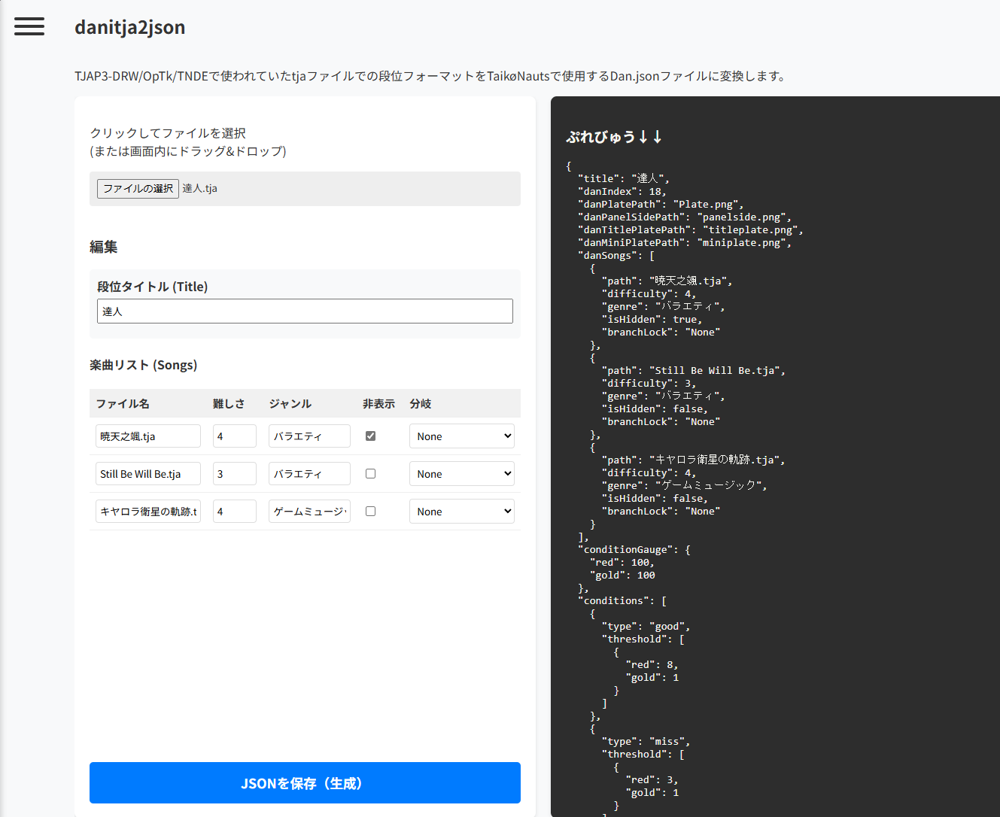

# DaniGeneratorTN
TaikoNautsの段位道場jsonを作成する**非公式**ツールです。
## アクセス
[https://miokamioka.github.io/DaniGeneratorTN/](https://miokamioka.github.io/DaniGeneratorTN/tja2json.html) へアクセスしてください。
## 説明
段位道場作成ツールは公式のものが作成されたため、更新を終了しています。\
元々ある段位道場tjaをDan.jsonに変換したい場合はdanitja2jsonへ。

### 段位道場作成ツール(更新終了のためアーカイブ化)
#### 段位名
- 段位名を指定します。十段だったり「挑戦！～～～」だったりとお好きな段位名をどうぞ。
#### 曲指定
- ファイルの選択ボタンから読み込んでください。.oszファイルも使えます。
#### 難易度
- 難易度を指定してください。
#### ジャンル
= ジャンルです。
#### 隠し曲にする
- 段位を選ぶ際、曲名のネタバレ防止で「???」になります。
#### ゲージの条件
- 赤条件、金条件を指定してください。デフォルトはどちらも100%以上です。
#### 個別条件にする
- 連打などに使用されるやつです。1曲毎にどれだけの条件かを指定できます。
#### 生成する
- 勝手にダウンロードされるはずなのでそれを使用してください。

### tja2json
- 段位tjaをファイルの選択ボタンから選択するか、PCの場合は画面内にドラッグ&ドロップしてください。

- 左側で編集、右側にjsonのプレビューを配置しています。
- 編集が終わったらjsonを保存ボタンでダウンロードされます。
- UTF8(BOM付)のファイルは対応していません。(出力したjsonが文字化けします)
- 最新のjsonの雛形に対応しています。